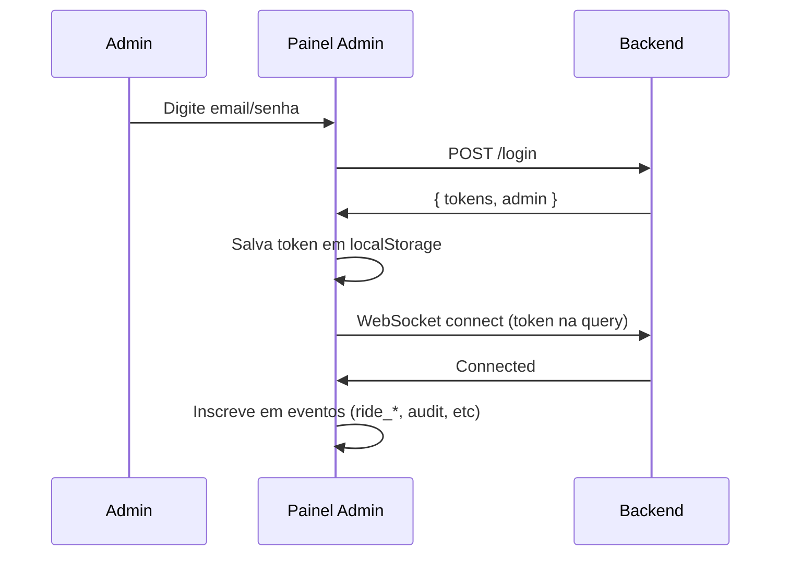
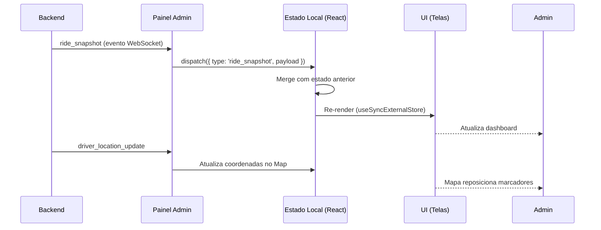

# Integração Painel Admin com Backend

## Visão Geral

O painel admin do VouDeMoto se conecta ao backend através de dois canais principais:

### 1. **Autenticação (HTTP REST)**
- **Endpoint**: `POST {VITE_API_BASE_URL}/login`
- **Headers**: `Content-Type: application/json`
- **Credenciais**: 
  ```json
  {
    "email": "admin@exemplo.com",
    "password": "senha"
  }
  ```
- **Resposta Esperada**:
  ```json
  {
    "tokens": {
      "accessToken": "jwt_token_aqui"
    },
    "admin": {
      "id": "admin_id",
      "role": "admin" | "operator" | "support"
    }
  }
  ```

### 2. **WebSocket em Tempo Real (WSS)**
- **URL**: `{VITE_REALTIME_URL}?token={accessToken}`
- **Protocolo**: WebSocket com JSON
- **Token**: Passado como query parameter na conexão
- **Reconexão Automática**: Exponencial backoff até 15 segundos

## Eventos Esperados do Backend

O painel inscreve-se nos seguintes eventos via WebSocket:

### `ride_snapshot`
Snapshot completo de uma corrida.
```json
{
  "event": "ride_snapshot",
  "payload": {
    "ride_id": "ride_123",
    "state": "searching_driver" | "driver_assigned" | "driver_arriving" | "in_progress" | "completed" | "canceled",
    "version": 1,
    "driver_id": "driver_123",
    "passenger_id": "passenger_123",
    "driver": { "id": "driver_123", "lat": -23.5505, "lng": -46.6333, "heading": 90 },
    "passenger": { "id": "passenger_123", "lat": -23.5500, "lng": -46.6330 },
    "updated_at": "2026-02-18T10:30:00Z"
  }
}
```

### `ride_state_changed`
Notificação de mudança de estado de uma corrida.
```json
{
  "event": "ride_state_changed",
  "payload": { ... } // Mesmo formato de ride_snapshot
}
```

### `driver_location_update`
Atualização periódica de localização do motorista.
```json
{
  "event": "driver_location_update",
  "payload": {
    "ride_id": "ride_123",
    "driver_id": "driver_123",
    "latitude": -23.5505,
    "longitude": -46.6333,
    "heading": 90,
    "timestamp": "2026-02-18T10:30:00Z"
  }
}
```

### `audit_event`
Evento de auditoria registrando ações administrativas.
```json
{
  "event": "audit_event",
  "payload": {
    "id": "audit_123",
    "actor_role": "admin",
    "actor_id": "admin_123",
    "action": "admin_cancel_ride",
    "target_id": "ride_123",
    "created_at": "2026-02-18T10:30:00Z"
  }
}
```

### `incident_created`
Nova escalação ou incidente reportado.
```json
{
  "event": "incident_created",
  "payload": {
    "id": "incident_123",
    "ride_id": "ride_123",
    "severity": "low" | "medium" | "high",
    "title": "Descrição do incidente",
    "details": "Detalhes completos",
    "created_at": "2026-02-18T10:30:00Z"
  }
}
```

### `system_health`
Status de saúde geral do sistema.
```json
{
  "event": "system_health",
  "payload": {
    "status": "ok" | "degraded" | "down",
    "updated_at": "2026-02-18T10:30:00Z",
    "notes": "Detalhes opcionais"
  }
}
```

## Ações Administrativas (do Painel para Backend)

O painel envia as seguintes ações para o backend via WebSocket:

### `admin_cancel_ride`
Cancelar uma corrida ativa.
```json
{
  "event": "admin_cancel_ride",
  "payload": {
    "ride_id": "ride_123",
    "reason": "Motorista indisponivel"
  }
}
```

### `admin_reassign_driver`
Reatribuir motorista a uma corrida.
```json
{
  "event": "admin_reassign_driver",
  "payload": {
    "ride_id": "ride_123",
    "new_driver_id": "driver_456",
    "reason": "admin_reassign"
  }
}
```

### `admin_force_complete`
Forçar conclusão de uma corrida.
```json
{
  "event": "admin_force_complete",
  "payload": {
    "ride_id": "ride_123",
    "reason": "Resolução manual"
  }
}
```

## Configuração de Ambiente

Criar arquivo `.env` na raiz de `painel-admin/`:

```dotenv
# URL base da API REST (sem trailing slash)
VITE_API_BASE_URL=https://seu-dominio.com/api/admin

# URL WebSocket para eventos em tempo real
VITE_REALTIME_URL=wss://seu-dominio.com/realtime
```

## Fluxo de Autenticação



## Fluxo de Dados em Tempo Real



## Tratamento de Erros

O painel trata os seguintes cenários:

- **Credenciais inválidas**: Exibe mensagem "Credenciais invalidas"
- **Token ausente**: Exibe mensagem "Token ausente na resposta"
- **Desconexão WebSocket**: Reconecta automaticamente com backoff exponencial
- **API Base URL ausente**: Exibe mensagem "VITE_API_BASE_URL ausente"

## Checklist de Operação

- [ ] Variáveis de ambiente configuradas (.env)
- [ ] Backend emite todos os 6 eventos esperados
- [ ] Login funciona e retorna token válido
- [ ] WebSocket conecta sem erros
- [ ] Corridas aparecem na tabela em tempo real
- [ ] Incidentes e auditoria populam feeds
- [ ] Mapa atualiza com posições de motorista
- [ ] Botões administrativos enviam eventos corretamente
- [ ] Status de conexão mostra "conectado"
- [ ] Taxa de conclusão calcula corretamente em Relatórios

## Troubleshooting

### WebSocket não conecta
- Verifique se `VITE_REALTIME_URL` está correto
- Verifique se o token é válido (localStorage)
- Verifique CORS no servidor WebSocket

### Eventos não chegam
- Verifique console.log em `realtimeStore.ts`
- Verifique nomes dos eventos (case-sensitive)
- Verifique estrutura do payload contra tipos em `types.ts`

### Ações não funcionam
- Verifique se o role do admin é "admin" ou "operator" (suporte é read-only)
- Verifique se eventos `admin_*` são gerados após clique
- Verifique payload do evento no console do navegador

## Performance

- **Limite de eventos armazenados**: 200 mais recentes para audit e incidents
- **Intervalo de atualização de mapa**: Aguarda WebSocket (event-driven, não polling)
- **Reconexão máxima**: 15 segundos (exponential backoff)
- **Rerender do painel**: Via `useSyncExternalStore` (sincronizado com estado global)
